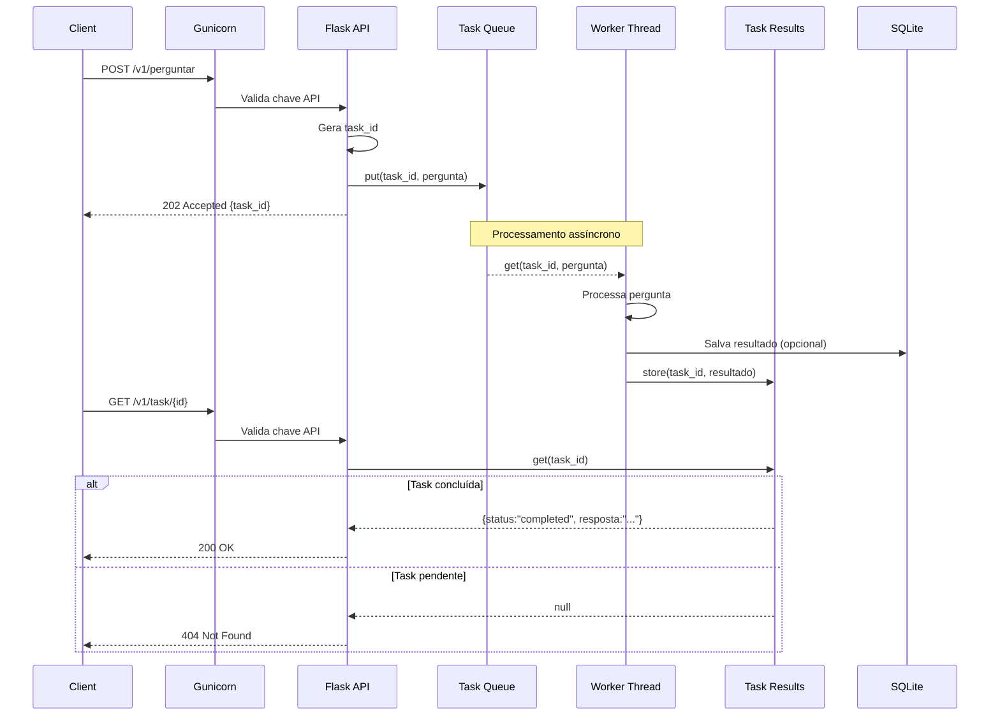
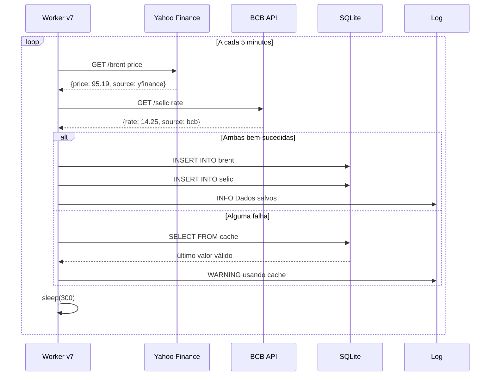
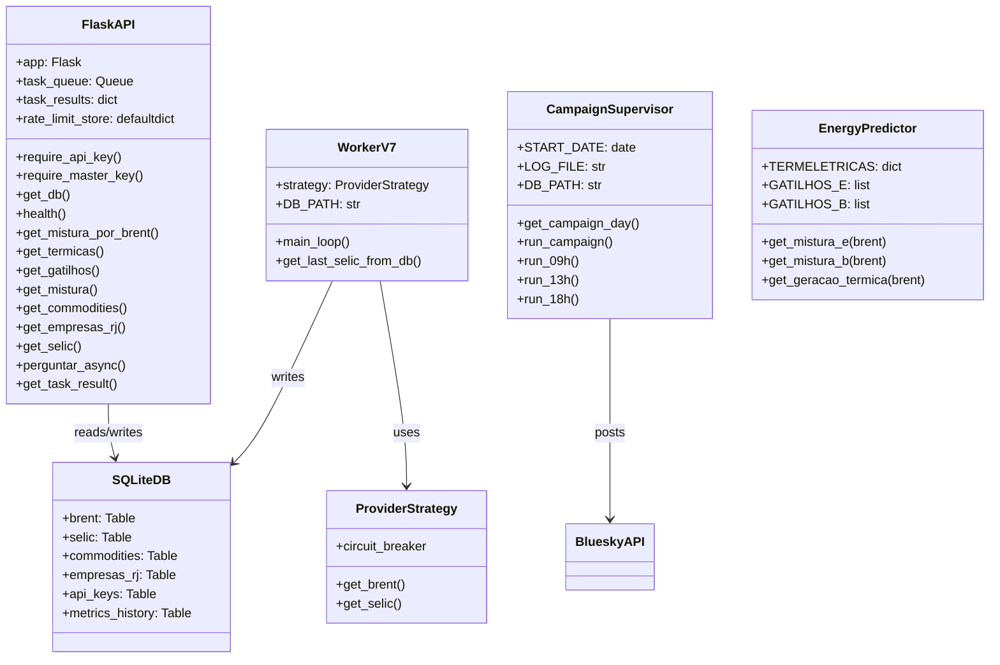
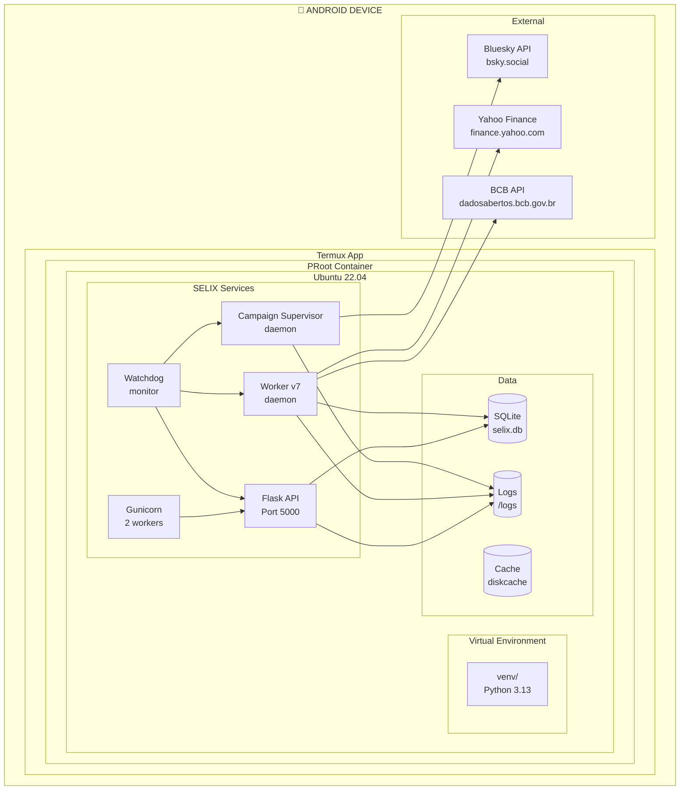
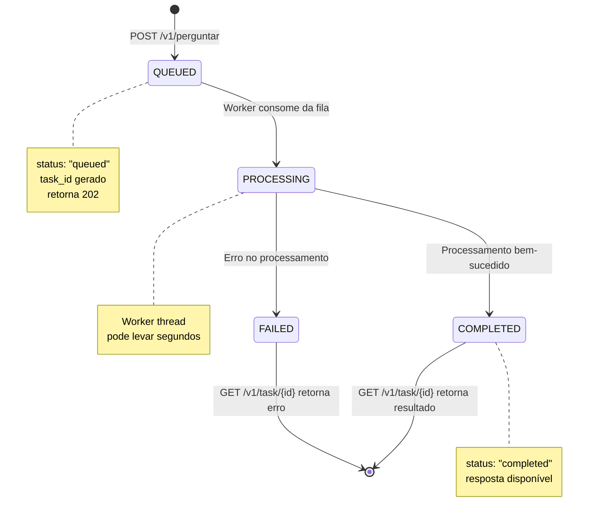

<div align="center">

# 🤖 SELIX v5.0 — Sistema de Inteligência Econômica Autônoma

**Selic real:** 14,25% · **Selic ideal:** 9,25% · **Economia anual:** R$ 270 bi

[](https://bsky.app/profile/zeh-sobrinho.bsky.social)
[](https://github.com/scoobiii/selix)
[](https://github.com/scoobiii/selix)
[](https://github.com/scoobiii/selix)
[](https://opensource.org/licenses/MIT)

</div>

---

## 🎯 O que é o SELIX?

SELIX é um **bot autônomo** que publica threads econômicas no Bluesky, coletando dados reais de mercado e processando perguntas de forma assíncrona.

### Funcionalidades principais

- ✅ **Coleta automática** de Selic (BCB) e Brent (Yahoo Finance) a cada 5 minutos
- ✅ **API REST** com autenticação, rate limiting e endpoints públicos/privados
- ✅ **Postagens automáticas** no Bluesky às 9h, 13h e 18h (BRT)
- ✅ **Endpoint assíncrono** `/perguntar` com fila em memória (retorna 202 Accepted)
- ✅ **Testado sob carga** – 80 usuários simultâneos, p95 < 200ms
- ✅ **83 testes unitários** – todos aprovados
- ✅ **Resiliente** – watchdog reinicia serviços automaticamente

---

## 📊 Status do Projeto

| Métrica | Status |
|---------|--------|
| **Versão** | v5.0-stable |
| **Build** | ✅ Passando |
| **Testes unitários** | 83/83 ✅ |
| **Stress test** | 80 VUs, p95=152ms ✅ |
| **Cobertura** | ~70% |
| **Disponibilidade** | 24/7 no Termux/Android |

---

## 🛠️ Arquitetura

```

┌─────────────────────────────────────────────────────────────┐
│                     CLIENTS (Bluesky, API)                   │
└─────────────────────────────────────────────────────────────┘
│
▼
┌─────────────────────────────────────────────────────────────┐
│                    GUNICORN (WSGI)                           │
│                   -w 2 --timeout 120                         │
└─────────────────────────────────────────────────────────────┘
│
▼
┌─────────────────────────────────────────────────────────────┐
│                    FLASK API (main_v4.py)                    │
│  ┌──────────────┐  ┌──────────────┐  ┌──────────────┐       │
│  │  /v1/health  │  │ /v1/commodities│ │/v1/perguntar │       │
│  │  /v1/selic   │  │ /v1/empresas/rj│ │  (fila+worker)│       │
│  └──────────────┘  └──────────────┘  └──────────────┘       │
└─────────────────────────────────────────────────────────────┘
│                    │                    │
▼                    ▼                    ▼
┌──────────────┐  ┌──────────────┐  ┌──────────────┐
│   SQLite     │  │    Worker    │  │  Campaign    │
│   selix.db   │  │  worker_v7   │  │  Supervisor  │
└──────────────┘  └──────────────┘  └──────────────┘

```

---

## 🚀 Instalação

### 1. Clone o repositório

```bash
git clone https://github.com/scoobiii/selix.git
cd selix
```

2. Crie o ambiente virtual e instale dependências

```bash
python3 -m venv venv
source venv/bin/activate
pip install -r requirements.txt
```

3. Configure as credenciais (Bluesky, API keys)

```bash
cp .env.example .env
nano .env   # preencha suas credenciais
```

4. Inicie o sistema

```bash
./run_selix.sh
```

---

🧪 Testes

Testes unitários

```bash
pytest tests/ -v
```

Teste de stress (k6)

```bash
bash tests/run_stress.sh
```

---

📖 Endpoints da API

Endpoint Método Autenticação Descrição
/v1/health GET Pública Status da API
/v1/energia/mistura/<brent> GET Pública Mix energético por Brent
/v1/energia/termicas GET Pública Lista de termelétricas
/v1/energia/gatilhos GET Pública Gatilhos de mistura
/v1/selic GET Chave API Última Selic real
/v1/commodities GET Chave API Preços de commodities
/v1/empresas/rj GET Chave API Empresas em RJ
/v1/perguntar POST Chave API Pergunta assíncrona (retorna task_id)
/v1/task/<id> GET Chave API Consulta resultado de task

---

📊 Resultados do Stress Test

Métrica Resultado Meta Status
Checks 100% 100% ✅
Erros 0% <5% ✅
p95 Latência 152ms <500ms ✅
VUs máximos 80 80 ✅
Throughput 51 req/s - ✅

---

🤝 Contribuição

1. Fork o projeto
2. Crie sua branch (git checkout -b feature/AmazingFeature)
3. Commit suas mudanças (git commit -m 'Add some AmazingFeature')
4. Push para a branch (git push origin feature/AmazingFeature)
5. Abra um Pull Request

---

📄 Licença

MIT © 2026 – Zeh Sobrinho, GOS3, MEX Energia

---

🔗 Links

· Repositório: https://github.com/scoobiii/selix
· Bluesky: @zeh-sobrinho.bsky.social
· Monitoramento: @selixbr.bsky.social
· Documentação: https://scoobiii.github.io/selix/


📊 Diagrama Mermaid da Arquitetura Completa

```mermaid
graph TB
    subgraph "🌐 EXTERNAL CLIENTS"
        BS[Bluesky Social]
        API_CLIENT[API Client]
        ADMIN[Admin Panel]
    end

    subgraph "🚀 ENTRY POINTS"
        GUNI[Gunicorn WSGI<br/>-w 2 --timeout 120]
    end

    subgraph "⚙️ SELIX CORE"
        FLASK[Flask API<br/>main_v4.py]
        
        subgraph "PUBLIC ENDPOINTS"
            HEALTH[/v1/health]
            MIX[/v1/energia/mistura/<int>]
            TERMICAS[/v1/energia/termicas]
            GATILHOS[/v1/energia/gatilhos]
        end
        
        subgraph "PRIVATE ENDPOINTS (API Key)"
            SELIC[/v1/selic]
            COMMODITIES[/v1/commodities]
            EMPRESAS[/v1/empresas/rj]
            PERGUNTAR[/v1/perguntar<br/>async task]
            TASK[/v1/task/<id>]
        end
        
        subgraph "ADMIN ENDPOINTS (Master Key)"
            GEN_KEY[/v1/admin/generate_key]
            LIST_KEYS[/v1/admin/list_keys]
            REVOKE[/v1/admin/revoke_key]
        end
    end

    subgraph "🧠 ASYNC LAYER"
        QUEUE[Task Queue<br/>queue.Queue]
        WORKER1[Worker Thread 1]
        WORKER2[Worker Thread 2]
        TASK_RESULT[Task Results<br/>in-memory dict]
    end

    subgraph "🔄 BACKGROUND SERVICES"
        WORKER_V7[Worker v7<br/>coleta dados]
        CAMPAIGN[Campaign Supervisor<br/>posts automáticos]
        WATCHDOG[Watchdog<br/>monitoramento]
    end

    subgraph "💾 DATA LAYER"
        SQLITE[(SQLite<br/>selix.db)]
        
        subgraph "TABLES"
            BRENT_TABLE[brent<br/>92 registros]
            SELIC_TABLE[selic<br/>91 registros]
            COMMODITIES_TABLE[commodities<br/>27 registros]
            METRICS_TABLE[metrics_history<br/>80 registros]
            EMPRESAS_TABLE[empresas_rj<br/>5 registros]
            API_KEYS_TABLE[api_keys<br/>53 registros]
        end
    end

    subgraph "🔌 EXTERNAL PROVIDERS"
        YAHOO[Yahoo Finance<br/>Brent Price]
        BCB[BCB API<br/>Selic Rate]
        BLUESKY_API[Bluesky API<br/>postagens]
    end

    %% CONNECTIONS
    BS --> GUNI
    API_CLIENT --> GUNI
    ADMIN --> GUNI
    
    GUNI --> FLASK
    
    FLASK --> HEALTH
    FLASK --> MIX
    FLASK --> TERMICAS
    FLASK --> GATILHOS
    FLASK --> SELIC
    FLASK --> COMMODITIES
    FLASK --> EMPRESAS
    FLASK --> PERGUNTAR
    FLASK --> TASK
    FLASK --> GEN_KEY
    FLASK --> LIST_KEYS
    FLASK --> REVOKE
    
    PERGUNTAR --> QUEUE
    QUEUE --> WORKER1
    QUEUE --> WORKER2
    WORKER1 --> TASK_RESULT
    WORKER2 --> TASK_RESULT
    TASK_RESULT --> TASK
    
    WORKER_V7 --> SQLITE
    CAMPAIGN --> BLUESKY_API
    
    WORKER_V7 --> YAHOO
    WORKER_V7 --> BCB
    
    SELIC --> SQLITE
    COMMODITIES --> SQLITE
    EMPRESAS --> SQLITE
    
    WATCHDOG -.-> WORKER_V7
    WATCHDOG -.-> FLASK
    WATCHDOG -.-> CAMPAIGN
    
    style FLASK fill:#f9f,stroke:#333,stroke-width:2px
    style SQLITE fill:#bbf,stroke:#333,stroke-width:2px
    style QUEUE fill:#ff9,stroke:#333,stroke-width:2px
    style WATCHDOG fill:#9f9,stroke:#333,stroke-width:1px,stroke-dasharray: 5 5
```

📊 Diagrama de Sequência UML (Mermaid)

Fluxo de uma pergunta assíncrona



Fluxo de coleta de dados (Worker v7)



📊 Diagrama de Classes UML (simplificado)



📊 Diagrama de Implantação (Deployment)



📊 Diagrama de Estados (Task Lifecycle)




```mermaid
graph TB
    subgraph "🌐 EXTERNAL CLIENTS"
        BS[Bluesky Social]
        API_CLIENT[API Client]
        ADMIN[Admin Panel]
    end

    subgraph "🚀 ENTRY POINTS"
        GUNI[Gunicorn WSGI<br/>-w 2 --timeout 120]
    end

    subgraph "⚙️ SELIX CORE"
        FLASK[Flask API<br/>main_v4.py]
        
        subgraph "PUBLIC ENDPOINTS"
            HEALTH[/v1/health/]
            MIX[/v1/energia/mistura/&lt;int&gt;]
            TERMICAS[/v1/energia/termicas/]
            GATILHOS[/v1/energia/gatilhos/]
        end
        
        subgraph "PRIVATE ENDPOINTS (API Key)"
            SELIC[/v1/selic/]
            COMMODITIES[/v1/commodities/]
            EMPRESAS[/v1/empresas/rj/]
            PERGUNTAR[/v1/perguntar/<br/>async task/]
            TASK[/v1/task/&lt;id&gt;/]
        end
        
        subgraph "ADMIN ENDPOINTS (Master Key)"
            GEN_KEY[/v1/admin/generate_key/]
            LIST_KEYS[/v1/admin/list_keys/]
            REVOKE[/v1/admin/revoke_key/]
        end
    end

    subgraph "🧠 ASYNC LAYER"
        QUEUE[Task Queue<br/>queue.Queue]
        WORKER1[Worker Thread 1]
        WORKER2[Worker Thread 2]
        TASK_RESULT[Task Results<br/>in-memory dict]
    end

    subgraph "🔄 BACKGROUND SERVICES"
        WORKER_V7[Worker v7<br/>coleta dados]
        CAMPAIGN[Campaign Supervisor<br/>posts automáticos]
        WATCHDOG[Watchdog<br/>monitoramento]
    end

    subgraph "💾 DATA LAYER"
        SQLITE[(SQLite<br/>selix.db)]
        
        subgraph "TABLES"
            BRENT_TABLE[brent<br/>92 registros]
            SELIC_TABLE[selic<br/>91 registros]
            COMMODITIES_TABLE[commodities<br/>27 registros]
            METRICS_TABLE[metrics_history<br/>80 registros]
            EMPRESAS_TABLE[empresas_rj<br/>5 registros]
            API_KEYS_TABLE[api_keys<br/>53 registros]
        end
    end

    subgraph "🔌 EXTERNAL PROVIDERS"
        YAHOO[Yahoo Finance<br/>Brent Price]
        BCB[BCB API<br/>Selic Rate]
        BLUESKY_API[Bluesky API<br/>postagens]
    end

    %% CONNECTIONS
    BS --> GUNI
    API_CLIENT --> GUNI
    ADMIN --> GUNI
    GUNI --> FLASK
    
    FLASK --> HEALTH
    FLASK --> MIX
    FLASK --> TERMICAS
    FLASK --> GATILHOS
    FLASK --> SELIC
    FLASK --> COMMODITIES
    FLASK --> EMPRESAS
    FLASK --> PERGUNTAR
    FLASK --> TASK
    FLASK --> GEN_KEY
    FLASK --> LIST_KEYS
    FLASK --> REVOKE
    
    PERGUNTAR --> QUEUE
    QUEUE --> WORKER1
    QUEUE --> WORKER2
    WORKER1 --> TASK_RESULT
    WORKER2 --> TASK_RESULT
    TASK_RESULT --> TASK
    
    WORKER_V7 --> SQLITE
    WORKER_V7 --> YAHOO
    WORKER_V7 --> BCB
    
    CAMPAIGN --> BLUESKY_API
    
    SELIC --> SQLITE
    COMMODITIES --> SQLITE
    EMPRESAS --> SQLITE
    
    WATCHDOG -.-> WORKER_V7
    WATCHDOG -.-> FLASK
    WATCHDOG -.-> CAMPAIGN

    style FLASK fill:#f9f,stroke:#333,stroke-width:2px
    style SQLITE fill:#bbf,stroke:#333,stroke-width:2px
    style QUEUE fill:#ff9,stroke:#333,stroke-width:2px
    style WATCHDOG fill:#9f9,stroke:#333,stroke-width:1px,stroke-dasharray: 5 5
```
