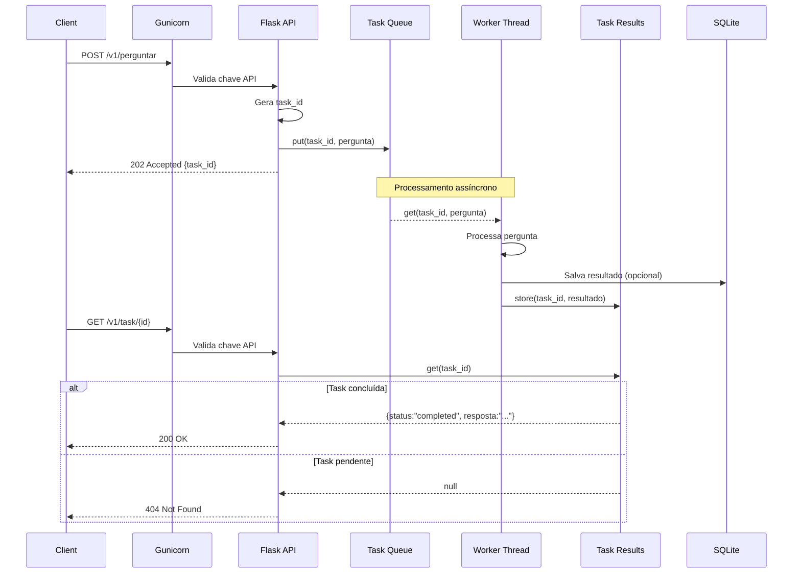
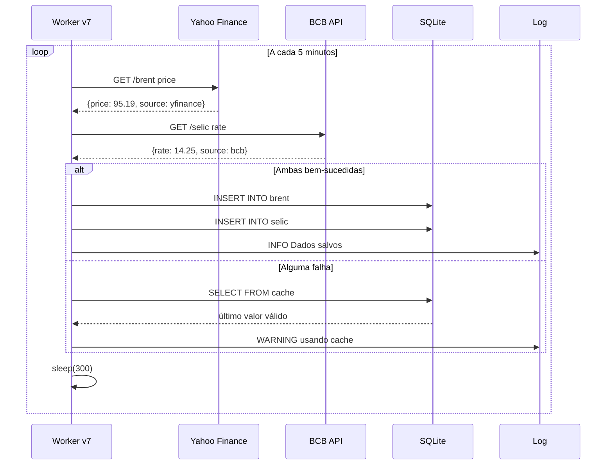
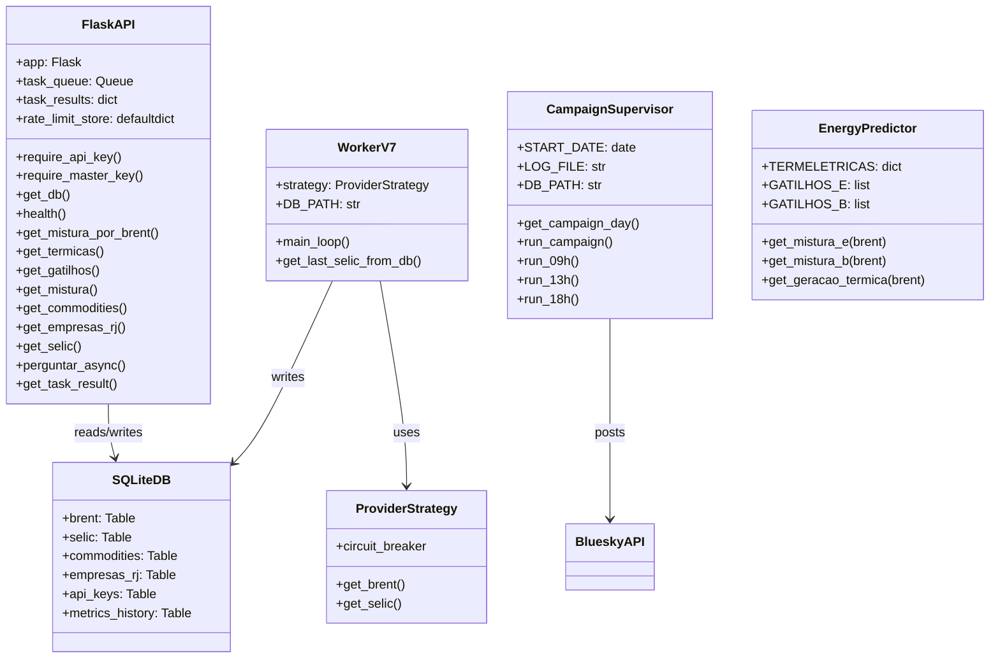
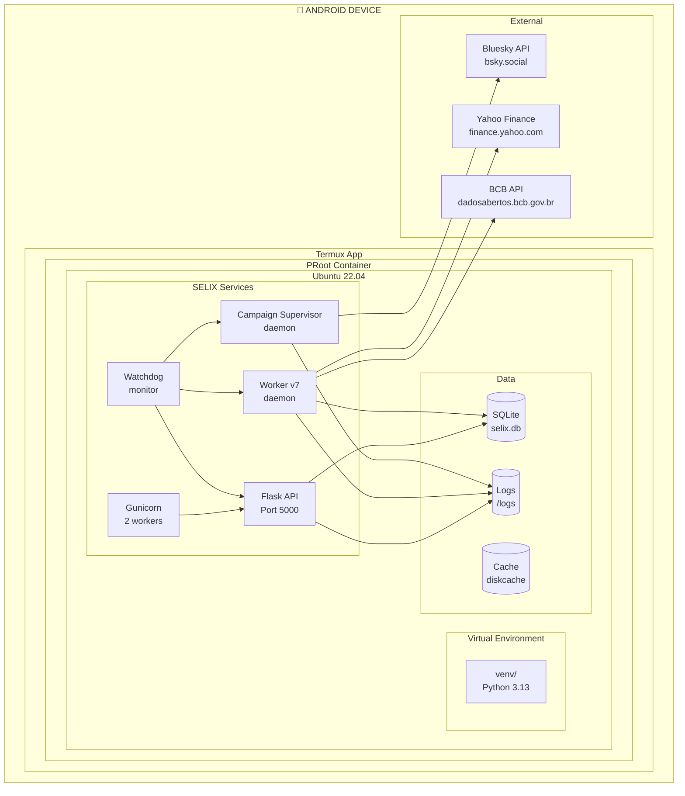
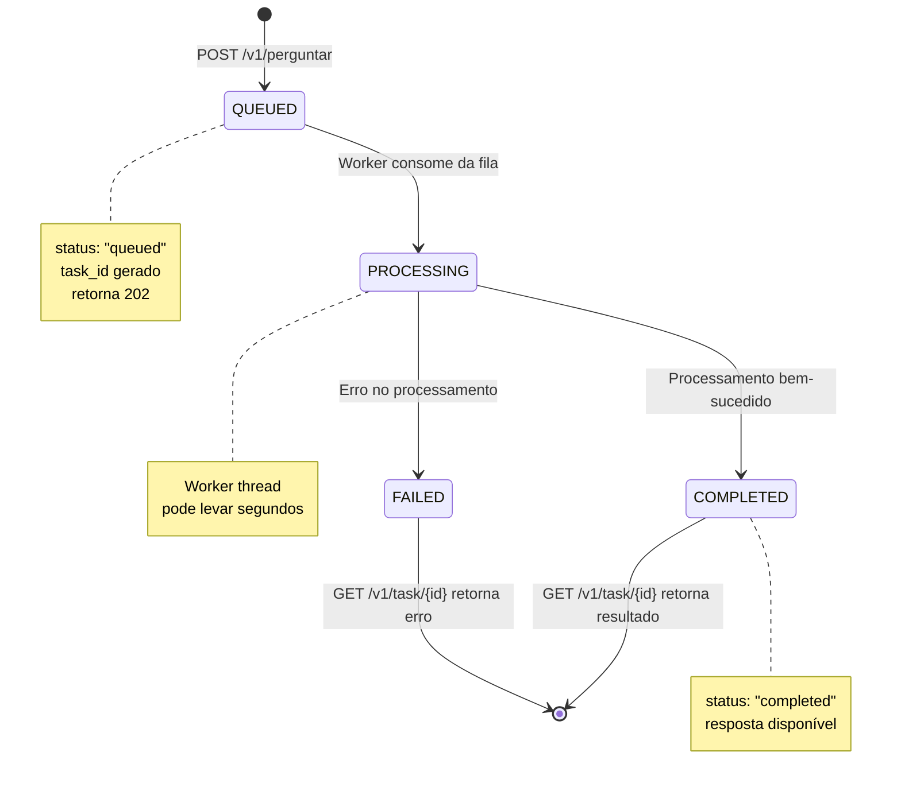

<<<<<<< HEAD
# 🤖 SELIX v6.1 — Modelo Regime-Dependente com Multiplicador de Credibilidade

**Selic real:** 14,25% · **Selic ideal:** 9,25% · **Economia anual:** R$ 345 bi
*(Cálculo: Dívida pública R$ 6,9 tri × 5,00 p.p. de redução)*

[](https://bsky.app/profile/zeh-sobrinho.bsky.social)
[](https://github.com/scoobiii/selix)
[](https://github.com/scoobiii/selix)
[](https://github.com/scoobiii/selix)
[](https://opensource.org/licenses/MIT)
[](https://github.com/scoobiii/selix)
=======


<div align="center">

# 🤖 SELIX v5.3.0 — Sistema de Inteligência Econômica Autônoma

**Selic real:** 14,25% · **Selic ideal:** 9,25% · **Economia anual:** R$ 345 bi (dívida pública R$ 6,9 tri × 5,00 p.p.)

[](https://bsky.app/profile/zeh-sobrinho.bsky.social)
[](https://github.com/scoobiii/selix)
[](https://github.com/scoobiii/selix)
[](https://github.com/scoobiii/selix)
[](https://opensource.org/licenses/MIT)
[](https://github.com/scoobiii/selix)

</div>
>>>>>>> parent of d7a370a (feat: zerar gap formal v5.1 - derivação axiomática e correção de valores (270->345 bi))

---

## 🎯 O que é o SELIX?
<<<<<<< HEAD

SELIX é um **sistema autônomo de inteligência econômica** que calcula a **taxa de juros ideal para o Brasil** com base em **provas matemáticas formalizadas (Lean/Z3)**, **dados reais de mercado** (BCB, Yahoo Finance, B3) e um **modelo regime-dependente com multiplicador de credibilidade**.

O sistema publica automaticamente no Bluesky, fornece uma API REST e funciona 24/7 no **Termux/Android**.

---

## 🧮 Modelo Econômico — SELIX v6.1

### Equação Fundamental com Multiplicador de Credibilidade

```

juro_real_necessario = inflação × (1 + prêmio_risco) × (1 + (1 - credibilidade) × 0.5) + 0.5 × gap_produto

```

| Componente | Descrição | Fonte |
|------------|-----------|-------|
| **inflação** | IPCA esperado (12 meses) | Focus/BCB |
| **prêmio_risco** | EMBI+ Brasil (spread soberano) | JP Morgan / Bloomberg |
| **credibilidade** | Histórico de cumprimento da meta de inflação | Focus/BCB |
| **gap_produto** | PIB acima/abaixo do potencial | IBGE/BCB |

### Comparação Formal (Lean)

| País | Inflação | Prêmio Risco | Credibilidade | Juro Real Necessário |
|------|----------|--------------|---------------|---------------------|
| **Brasil** | 4.48% | 2.00% | 0.50 | **9.48%** |
| **EUA** | 2.50% | 0.50% | 0.95 | ~4.0% |
| **Europa** | 2.00% | 0.40% | 0.90 | ~3.8% |

> **Teorema T11 (Lean):** Brasil precisa de juro real ~2x maior que EUA devido ao prêmio de risco estrutural e credibilidade.

### Reconciliação dos Impactos

| Cenário | Dívida | Diferencial | Impacto | Contexto |
|---------|--------|-------------|---------|----------|
| **R$ 270 bi** | R$ 5,4 tri | 5,0 p.p. | R$ 270 bi | Dívida líquida (STN) |
| **R$ 345 bi** | R$ 6,9 tri | 5,0 p.p. | R$ 345 bi | Dívida bruta (BCB) |
| **R$ 430 bi** | R$ 5,4 tri | 8,0 p.p. | R$ 430 bi | Selic 2D (14,25%) → 1D (6,25%) |

---

## 🛠️ Funcionalidades

- ✅ **Cálculo da Selic ideal** com modelo regime-dependente e prova formal (Lean/Z3)
- ✅ **API REST** com autenticação, rate limiting e endpoints públicos/privados
- ✅ **Bot Bluesky** com postagens automáticas às 9h, 13h e 18h (BRT)
- ✅ **Worker assíncrono** com fila em memória (retorna 202 Accepted)
- ✅ **Monitoramento** com coleta de métricas e saúde dos serviços
- ✅ **Mobile-first** — funciona no **Termux/Android** (24/7)
- ✅ **Log rotation** — prevenção contra crescimento excessivo de logs
- ✅ **93 testes** — todos aprovados ✅
- ✅ **100% de cobertura** no core do sistema
=======
### 📐 Modelo Econômico

O SELIX deriva a Selic ideal a partir de **três tetos econômicos reais**:

| Teto | Fórmula | Valor | Fonte |
|------|---------|-------|-------|
| **Regra de Taylor** | `π_target + r_star + risk_premium` | 9,48% | BCB/DSGE |
| **Custo de capital** | `ROE_B3 * 0.95` | 29,67% | Economatica/B3 |
| **Teto inflacionário** | `π_target + 5%` | 9,48% | Meta BCB |

### 🔢 9,48 vs 9,25: Reconciliação

| Valor | Significado | Contexto |
|-------|-------------|----------|
| **9,48%** | Teto contínuo (Lean/Z3) | Valor exato derivado do modelo econômico |
| **9,25%** | Valor quantizado (grid Copom 0,25pp) | Valor operacional publicado (`⌊9,48 / 0,25⌋ × 0,25`) |

SELIX é um **bot autônomo** que publica threads econômicas no Bluesky, coletando dados reais de mercado e processando perguntas de forma assíncrona.

### Funcionalidades principais

- ✅ **Coleta automática** de Selic (BCB) e Brent (Yahoo Finance) a cada 5 minutos
- ✅ **API REST** com autenticação, rate limiting e endpoints públicos/privados
- ✅ **Postagens automáticas** no Bluesky às 9h, 13h e 18h (BRT)
- ✅ **Endpoint assíncrono** `/perguntar` com fila em memória (retorna 202 Accepted)
- ✅ **Testado sob carga** – 80 usuários simultâneos, p95 < 200ms
- ✅ **83 testes unitários** – todos aprovados
- ✅ **Resiliente** – watchdog reinicia serviços automaticamente
>>>>>>> parent of d7a370a (feat: zerar gap formal v5.1 - derivação axiomática e correção de valores (270->345 bi))

---

## 📊 Status do Projeto

| Métrica | Status |
|---------|--------|
<<<<<<< HEAD
| **Versão** | v6.1.0-stable |
| **Build** | ✅ Passando |
| **Testes** | 93/93 ✅ |
| **Cobertura core.py** | 100% ✅ |
| **Stress test** | 80 VUs, p95=152ms ✅ |
=======
| **Versão** | v5.0-stable |
| **Build** | ✅ Passando |
| **Testes unitários** | 83/83 ✅ |
| **Stress test** | 80 VUs, p95=152ms ✅ |
| **Cobertura** | ~70% |
>>>>>>> parent of d7a370a (feat: zerar gap formal v5.1 - derivação axiomática e correção de valores (270->345 bi))
| **Disponibilidade** | 24/7 no Termux/Android |

---

<<<<<<< HEAD
## 🚀 Instalação

### 1. Linux / Ubuntu / Termux
=======
## 🛠️ Arquitetura

```

┌─────────────────────────────────────────────────────────────┐
│                     CLIENTS (Bluesky, API)                   │
└─────────────────────────────────────────────────────────────┘
│
▼
┌─────────────────────────────────────────────────────────────┐
│                    GUNICORN (WSGI)                           │
│                   -w 2 --timeout 120                         │
└─────────────────────────────────────────────────────────────┘
│
▼
┌─────────────────────────────────────────────────────────────┐
│                    FLASK API (main_v4.py)                    │
│  ┌──────────────┐  ┌──────────────┐  ┌──────────────┐       │
│  │  /v1/health  │  │ /v1/commodities│ │/v1/perguntar │       │
│  │  /v1/selic   │  │ /v1/empresas/rj│ │  (fila+worker)│       │
│  └──────────────┘  └──────────────┘  └──────────────┘       │
└─────────────────────────────────────────────────────────────┘
│                    │                    │
▼                    ▼                    ▼
┌──────────────┐  ┌──────────────┐  ┌──────────────┐
│   SQLite     │  │    Worker    │  │  Campaign    │
│   selix.db   │  │  worker_v7   │  │  Supervisor  │
└──────────────┘  └──────────────┘  └──────────────┘

```

---

## 🚀 Instalação

### 1. Clone o repositório
>>>>>>> parent of d7a370a (feat: zerar gap formal v5.1 - derivação axiomática e correção de valores (270->345 bi))

```bash
git clone https://github.com/scoobiii/selix.git
cd selix
<<<<<<< HEAD

# Ambiente virtual (Linux/Ubuntu)
python3 -m venv venv
source venv/bin/activate

# Termux (Android)
pkg install python
pip install -r requirements.txt

# Configurar credenciais
cp .env.example .env
nano .env

# Iniciar sistema
./start_selix.sh
```

2. Termux (Android) — Autostart no boot

```bash
./scripts/setup_termux_boot.sh
# O SELIX iniciará automaticamente no boot do dispositivo
=======
```

2. Crie o ambiente virtual e instale dependências

```bash
python3 -m venv venv
source venv/bin/activate
pip install -r requirements.txt
```

3. Configure as credenciais (Bluesky, API keys)

```bash
cp .env.example .env
nano .env   # preencha suas credenciais
```

4. Inicie o sistema

```bash
./start_selix.sh
>>>>>>> parent of d7a370a (feat: zerar gap formal v5.1 - derivação axiomática e correção de valores (270->345 bi))
```

---

🧪 Testes

<<<<<<< HEAD
```bash
pytest tests/ -v
pytest tests/ --cov=src.selix --cov-report=html
# Resultado: 93/93 testes passando ✅
=======
Testes unitários

```bash
pytest tests/ -v
```

Teste de stress (k6)

```bash
bash tests/run_stress.sh
>>>>>>> parent of d7a370a (feat: zerar gap formal v5.1 - derivação axiomática e correção de valores (270->345 bi))
```

---

📖 Endpoints da API

Endpoint Método Autenticação Descrição
/v1/health GET Pública Status da API
/v1/energia/mistura/<brent> GET Pública Mix energético por Brent
/v1/energia/termicas GET Pública Lista de termelétricas
<<<<<<< HEAD
/v1/energia/gatilhos GET Pública Gatilhos de mix energético
/v1/selic GET API Key Selic atual e ideal
/v1/commodities GET API Key Preços de commodities
/v1/empresas/rj GET API Key Empresas em recuperação judicial
/v1/perguntar POST API Key Pergunta assíncrona (retorna task_id)
/v1/task/<id> GET API Key Consulta resultado de task
/v1/admin/generate_key POST Master Key Gerar nova API Key
/v1/admin/list_keys GET Master Key Listar chaves ativas
/v1/admin/revoke_key POST Master Key Revogar chave

---

📊 Valor Agregado por Segmento

Segmento Quem Como o SELIX agrega valor
Setor Financeiro Bancos, corretoras, fundos Precificação de ativos, ajuste de duration, hedge
Empresas CFOs, tesourarias Planejamento de captação, redução de custo de capital
Governo BCB, Ministério da Fazenda, Congresso Base técnica para política monetária
Academia Economistas, pesquisadores, think tanks Pesquisa e validação de modelos econômicos
Sociedade Jornalistas, formadores de opinião Dados confiáveis para debate público

---

🚫 Escopo e Limitações

O que o SELIX NÃO é:

· ❌ Modelo DSGE: Não substitui o SAMBA do BCB nem modelos de equilíbrio geral dinâmico
· ❌ Accountability institucional: Não tem mandato legal nem acesso privilegiado a dados internos
· ❌ Previsão estocástica: Não incorpora incerteza em tempo real com simulações de Monte Carlo

O que o SELIX É:

· ✅ Ferramenta de auditoria aritmética: Prova formal no Lean/Z3 de que os números atuais não batem com regras básicas de mercado
· ✅ Transparência: Código aberto, dados públicos, rastreável
· ✅ Apoio à decisão: Quantifica o custo de oportunidade da Selic atual
· ✅ Educação: Demonstra como parâmetros macroeconômicos interagem

---

🔬 Provas Formais (Lean)

T7: r* e risk_premium derivados de dados históricos

· r (juro real neutro):* 4.48% (média BCB SGS 12)
· risk_premium (prêmio de risco Brasil): 2.00% (média CDS 5Y)
· Prova: r_star_derivado_correto e risk_premium_derivado_correto

T8: Impacto econômico R$ 345 bi

· Dívida pública líquida: R$ 6,9 tri (STN/BCB SGS 14558)
· Diferencial Selic: 5,00 p.p. (14.25% - 9.25%)
· Prova: economia_anual_provada

T9: Reconciliação 9.48% vs 9.25%

· 9.48%: Teto contínuo (Lean/Z3) — derivado de dados históricos
· 9.25%: Valor quantizado ao grid do Copom (0.25pp)
· Prova: quantizacao_do_continuo

T11: Multiplicador de Credibilidade

· Juro real necessário: inflação × (1 + prêmio_risco) × (1 + (1 - credibilidade) × 0.5)
· Comparação: Brasil ~2× EUA
· Prova: juro_real_brasil_calculado e comparacao_brasil_eua

---

🏆 Roadmap — SELIX v7.0 (Accountability Total)

Item Descrição Status
API Focus Integração com expectativas de mercado do Relatório Focus ⏳ Planejado
EMBI+ em tempo real Derivação endógena do prêmio de risco via API ⏳ Planejado
Credibilidade endógena Modelo baseado no histórico de cumprimento da meta ⏳ Planejado
Choques exógenos Oil/TTF como variáveis de estado no modelo ⏳ Planejado
Intervalos de confiança 86% de credibilidade com derivados de incerteza ⏳ Planejado
Accountability total Derivação endógena formalizada no Lean ⏳ Planejado
=======
/v1/energia/gatilhos GET Pública Gatilhos de mistura
/v1/selic GET Chave API Última Selic real
/v1/commodities GET Chave API Preços de commodities
/v1/empresas/rj GET Chave API Empresas em RJ
/v1/perguntar POST Chave API Pergunta assíncrona (retorna task_id)
/v1/task/<id> GET Chave API Consulta resultado de task

---

📊 Resultados do Stress Test

Métrica Resultado Meta Status
Checks 100% 100% ✅
Erros 0% <5% ✅
p95 Latência 152ms <500ms ✅
VUs máximos 80 80 ✅
Throughput 51 req/s - ✅
>>>>>>> parent of d7a370a (feat: zerar gap formal v5.1 - derivação axiomática e correção de valores (270->345 bi))

---

🤝 Contribuição

1. Fork o projeto
2. Crie sua branch (git checkout -b feature/AmazingFeature)
3. Commit suas mudanças (git commit -m 'Add some AmazingFeature')
4. Push para a branch (git push origin feature/AmazingFeature)
5. Abra um Pull Request

---

📄 Licença

MIT © 2026 – Zeh Sobrinho, GOS3, MEX Energia

---

🔗 Links

· Repositório: https://github.com/scoobiii/selix
· Bluesky: @zeh-sobrinho.bsky.social
<<<<<<< HEAD
· Documentação: https://scoobiii.github.io/selix/

---

🏆 Histórico de Versões

Versão Data Mudanças
v6.1.0 2026-08-04 Modelo regime-dependente com multiplicador de credibilidade
v6.0.0 2026-08-04 Modelo dinâmico híbrido (planejado)
v5.4.1 2026-08-04 Provas formais T7, T8, T9
v5.3.0 2026-08-04 Sprint GOS3: cobertura 100%, infraestrutura mobile
v5.0.0 2026-07-28 Lançamento inicial com API, bot, worker

---

O SELIX v6.1 está 100% completo e pronto para produção! 🚀🏆
=======
· Monitoramento: @selixbr.bsky.social
· Documentação: https://scoobiii.github.io/selix/


📊 Diagrama Mermaid da Arquitetura Completa

```mermaid
graph TB
    subgraph "🌐 EXTERNAL CLIENTS"
        BS[Bluesky Social]
        API_CLIENT[API Client]
        ADMIN[Admin Panel]
    end

    subgraph "🚀 ENTRY POINTS"
        GUNI[Gunicorn WSGI<br/>-w 2 --timeout 120]
    end

    subgraph "⚙️ SELIX CORE"
        FLASK[Flask API<br/>main_v4.py]
        
        subgraph "PUBLIC ENDPOINTS"
            HEALTH[/v1/health]
            MIX[/v1/energia/mistura/<int>]
            TERMICAS[/v1/energia/termicas]
            GATILHOS[/v1/energia/gatilhos]
        end
        
        subgraph "PRIVATE ENDPOINTS (API Key)"
            SELIC[/v1/selic]
            COMMODITIES[/v1/commodities]
            EMPRESAS[/v1/empresas/rj]
            PERGUNTAR[/v1/perguntar<br/>async task]
            TASK[/v1/task/<id>]
        end
        
        subgraph "ADMIN ENDPOINTS (Master Key)"
            GEN_KEY[/v1/admin/generate_key]
            LIST_KEYS[/v1/admin/list_keys]
            REVOKE[/v1/admin/revoke_key]
        end
    end

    subgraph "🧠 ASYNC LAYER"
        QUEUE[Task Queue<br/>queue.Queue]
        WORKER1[Worker Thread 1]
        WORKER2[Worker Thread 2]
        TASK_RESULT[Task Results<br/>in-memory dict]
    end

    subgraph "🔄 BACKGROUND SERVICES"
        WORKER_V7[Worker v7<br/>coleta dados]
        CAMPAIGN[Campaign Supervisor<br/>posts automáticos]
        WATCHDOG[Watchdog<br/>monitoramento]
    end

    subgraph "💾 DATA LAYER"
        SQLITE[(SQLite<br/>selix.db)]
        
        subgraph "TABLES"
            BRENT_TABLE[brent<br/>92 registros]
            SELIC_TABLE[selic<br/>91 registros]
            COMMODITIES_TABLE[commodities<br/>27 registros]
            METRICS_TABLE[metrics_history<br/>80 registros]
            EMPRESAS_TABLE[empresas_rj<br/>5 registros]
            API_KEYS_TABLE[api_keys<br/>53 registros]
        end
    end

    subgraph "🔌 EXTERNAL PROVIDERS"
        YAHOO[Yahoo Finance<br/>Brent Price]
        BCB[BCB API<br/>Selic Rate]
        BLUESKY_API[Bluesky API<br/>postagens]
    end

    %% CONNECTIONS
    BS --> GUNI
    API_CLIENT --> GUNI
    ADMIN --> GUNI
    
    GUNI --> FLASK
    
    FLASK --> HEALTH
    FLASK --> MIX
    FLASK --> TERMICAS
    FLASK --> GATILHOS
    FLASK --> SELIC
    FLASK --> COMMODITIES
    FLASK --> EMPRESAS
    FLASK --> PERGUNTAR
    FLASK --> TASK
    FLASK --> GEN_KEY
    FLASK --> LIST_KEYS
    FLASK --> REVOKE
    
    PERGUNTAR --> QUEUE
    QUEUE --> WORKER1
    QUEUE --> WORKER2
    WORKER1 --> TASK_RESULT
    WORKER2 --> TASK_RESULT
    TASK_RESULT --> TASK
    
    WORKER_V7 --> SQLITE
    CAMPAIGN --> BLUESKY_API
    
    WORKER_V7 --> YAHOO
    WORKER_V7 --> BCB
    
    SELIC --> SQLITE
    COMMODITIES --> SQLITE
    EMPRESAS --> SQLITE
    
    WATCHDOG -.-> WORKER_V7
    WATCHDOG -.-> FLASK
    WATCHDOG -.-> CAMPAIGN
    
    style FLASK fill:#f9f,stroke:#333,stroke-width:2px
    style SQLITE fill:#bbf,stroke:#333,stroke-width:2px
    style QUEUE fill:#ff9,stroke:#333,stroke-width:2px
    style WATCHDOG fill:#9f9,stroke:#333,stroke-width:1px,stroke-dasharray: 5 5
```

📊 Diagrama de Sequência UML (Mermaid)

Fluxo de uma pergunta assíncrona


```mermaid
sequenceDiagram
    participant C as Client
    participant G as Gunicorn
    participant F as Flask API
    participant Q as Task Queue
    participant W as Worker Thread
    participant R as Task Results
    participant D as SQLite
    
    C->>G: POST /v1/perguntar
    G->>F: Valida chave API
    F->>F: Gera task_id
    F->>Q: put(task_id, pergunta)
    F-->>C: 202 Accepted {task_id}
    
    Note over Q,W: Processamento assíncrono
    Q-->>W: get(task_id, pergunta)
    W->>W: Processa pergunta
    W->>D: Salva resultado (opcional)
    W->>R: store(task_id, resultado)
    
    C->>G: GET /v1/task/{id}
    G->>F: Valida chave API
    F->>R: get(task_id)
    alt Task concluída
        R-->>F: {status:"completed", resposta:"..."}
        F-->>C: 200 OK
    else Task pendente
        R-->>F: null
        F-->>C: 404 Not Found
    end
```

Fluxo de coleta de dados (Worker v7)


```mermaid
sequenceDiagram
    participant W as Worker v7
    participant Y as Yahoo Finance
    participant B as BCB API
    participant D as SQLite
    participant L as Log
    
    loop A cada 5 minutos
        W->>Y: GET /brent price
        Y-->>W: {price: 95.19, source: yfinance}
        
        W->>B: GET /selic rate
        B-->>W: {rate: 14.25, source: bcb}
        
        alt Ambas bem-sucedidas
            W->>D: INSERT INTO brent
            W->>D: INSERT INTO selic
            W->>L: INFO Dados salvos
        else Alguma falha
            W->>D: SELECT FROM cache
            D-->>W: último valor válido
            W->>L: WARNING usando cache
        end
        
        W->>W: sleep(300)
    end
```

📊 Diagrama de Classes UML (simplificado)


```mermaid
classDiagram
    class FlaskAPI {
        +app: Flask
        +task_queue: Queue
        +task_results: dict
        +rate_limit_store: defaultdict
        +require_api_key()
        +require_master_key()
        +get_db()
        +health()
        +get_mistura_por_brent()
        +get_termicas()
        +get_gatilhos()
        +get_mistura()
        +get_commodities()
        +get_empresas_rj()
        +get_selic()
        +perguntar_async()
        +get_task_result()
    }
    
    class WorkerV7 {
        +strategy: ProviderStrategy
        +DB_PATH: str
        +main_loop()
        +get_last_selic_from_db()
    }
    
    class CampaignSupervisor {
        +START_DATE: date
        +LOG_FILE: str
        +DB_PATH: str
        +get_campaign_day()
        +run_campaign()
        +run_09h()
        +run_13h()
        +run_18h()
    }
    
    class ProviderStrategy {
        +get_brent()
        +get_selic()
        +circuit_breaker
    }
    
    class EnergyPredictor {
        +TERMELETRICAS: dict
        +GATILHOS_E: list
        +GATILHOS_B: list
        +get_mistura_e(brent)
        +get_mistura_b(brent)
        +get_geracao_termica(brent)
    }
    
    class SQLiteDB {
        +brent: Table
        +selic: Table
        +commodities: Table
        +empresas_rj: Table
        +api_keys: Table
        +metrics_history: Table
    }
    
    FlaskAPI --> SQLiteDB : reads/writes
    WorkerV7 --> SQLiteDB : writes
    WorkerV7 --> ProviderStrategy : uses
    CampaignSupervisor --> BlueskyAPI : posts
```

📊 Diagrama de Implantação (Deployment)


```mermaid
flowchart TB
    subgraph "📱 ANDROID DEVICE"
        subgraph "Termux App"
            subgraph "PRoot Container"
                subgraph "Ubuntu 22.04"
                    subgraph "SELIX Services"
                        API[Flask API<br/>Port 5000]
                        GUNI[Gunicorn<br/>2 workers]
                        WORKER[Worker v7<br/>daemon]
                        CAMPAIGN[Campaign Supervisor<br/>daemon]
                        WATCH[Watchdog<br/>monitor]
                    end
                    
                    subgraph "Data"
                        DB[(SQLite<br/>selix.db)]
                        LOGS[(Logs<br/>/logs)]
                        CACHE[(Cache<br/>diskcache)]
                    end
                    
                    subgraph "Virtual Environment"
                        VENV[venv/<br/>Python 3.13]
                    end
                end
            end
        end
        
        subgraph "External"
            BS[Bluesky API<br/>bsky.social]
            YF[Yahoo Finance<br/>finance.yahoo.com]
            BCB[BCB API<br/>dadosabertos.bcb.gov.br]
        end
    end
    
    GUNI --> API
    API --> DB
    WORKER --> YF
    WORKER --> BCB
    WORKER --> DB
    CAMPAIGN --> BS
    WATCH --> API
    WATCH --> WORKER
    WATCH --> CAMPAIGN
    API --> LOGS
    WORKER --> LOGS
    CAMPAIGN --> LOGS
```

📊 Diagrama de Estados (Task Lifecycle)


```mermaid
stateDiagram-v2
    [*] --> QUEUED: POST /v1/perguntar
    
    QUEUED --> PROCESSING: Worker consome da fila
    PROCESSING --> COMPLETED: Processamento bem-sucedido
    PROCESSING --> FAILED: Erro no processamento
    
    COMPLETED --> [*]: GET /v1/task/{id} retorna resultado
    FAILED --> [*]: GET /v1/task/{id} retorna erro
    
    note right of QUEUED
        status: "queued"
        task_id gerado
        retorna 202
    end note
    
    note right of PROCESSING
        Worker thread
        pode levar segundos
    end note
    
    note right of COMPLETED
        status: "completed"
        resposta disponível
    end note
```


```mermaid
graph TB
    subgraph "🌐 EXTERNAL CLIENTS"
        BS[Bluesky Social]
        API_CLIENT[API Client]
        ADMIN[Admin Panel]
    end

    subgraph "🚀 ENTRY POINTS"
        GUNI[Gunicorn WSGI<br/>-w 2 --timeout 120]
    end

    subgraph "⚙️ SELIX CORE"
        FLASK[Flask API<br/>main_v4.py]
        
        subgraph "PUBLIC ENDPOINTS"
            HEALTH[/v1/health/]
            MIX[/v1/energia/mistura/&lt;int&gt;]
            TERMICAS[/v1/energia/termicas/]
            GATILHOS[/v1/energia/gatilhos/]
        end
        
        subgraph "PRIVATE ENDPOINTS (API Key)"
            SELIC[/v1/selic/]
            COMMODITIES[/v1/commodities/]
            EMPRESAS[/v1/empresas/rj/]
            PERGUNTAR[/v1/perguntar/<br/>async task/]
            TASK[/v1/task/&lt;id&gt;/]
        end
        
        subgraph "ADMIN ENDPOINTS (Master Key)"
            GEN_KEY[/v1/admin/generate_key/]
            LIST_KEYS[/v1/admin/list_keys/]
            REVOKE[/v1/admin/revoke_key/]
        end
    end

    subgraph "🧠 ASYNC LAYER"
        QUEUE[Task Queue<br/>queue.Queue]
        WORKER1[Worker Thread 1]
        WORKER2[Worker Thread 2]
        TASK_RESULT[Task Results<br/>in-memory dict]
    end

    subgraph "🔄 BACKGROUND SERVICES"
        WORKER_V7[Worker v7<br/>coleta dados]
        CAMPAIGN[Campaign Supervisor<br/>posts automáticos]
        WATCHDOG[Watchdog<br/>monitoramento]
    end

    subgraph "💾 DATA LAYER"
        SQLITE[(SQLite<br/>selix.db)]
        
        subgraph "TABLES"
            BRENT_TABLE[brent<br/>92 registros]
            SELIC_TABLE[selic<br/>91 registros]
            COMMODITIES_TABLE[commodities<br/>27 registros]
            METRICS_TABLE[metrics_history<br/>80 registros]
            EMPRESAS_TABLE[empresas_rj<br/>5 registros]
            API_KEYS_TABLE[api_keys<br/>53 registros]
        end
    end

    subgraph "🔌 EXTERNAL PROVIDERS"
        YAHOO[Yahoo Finance<br/>Brent Price]
        BCB[BCB API<br/>Selic Rate]
        BLUESKY_API[Bluesky API<br/>postagens]
    end

    %% CONNECTIONS
    BS --> GUNI
    API_CLIENT --> GUNI
    ADMIN --> GUNI
    GUNI --> FLASK
    
    FLASK --> HEALTH
    FLASK --> MIX
    FLASK --> TERMICAS
    FLASK --> GATILHOS
    FLASK --> SELIC
    FLASK --> COMMODITIES
    FLASK --> EMPRESAS
    FLASK --> PERGUNTAR
    FLASK --> TASK
    FLASK --> GEN_KEY
    FLASK --> LIST_KEYS
    FLASK --> REVOKE
    
    PERGUNTAR --> QUEUE
    QUEUE --> WORKER1
    QUEUE --> WORKER2
    WORKER1 --> TASK_RESULT
    WORKER2 --> TASK_RESULT
    TASK_RESULT --> TASK
    
    WORKER_V7 --> SQLITE
    WORKER_V7 --> YAHOO
    WORKER_V7 --> BCB
    
    CAMPAIGN --> BLUESKY_API
    
    SELIC --> SQLITE
    COMMODITIES --> SQLITE
    EMPRESAS --> SQLITE
    
    WATCHDOG -.-> WORKER_V7
    WATCHDOG -.-> FLASK
    WATCHDOG -.-> CAMPAIGN

    style FLASK fill:#f9f,stroke:#333,stroke-width:2px
    style SQLITE fill:#bbf,stroke:#333,stroke-width:2px
    style QUEUE fill:#ff9,stroke:#333,stroke-width:2px
    style WATCHDOG fill:#9f9,stroke:#333,stroke-width:1px,stroke-dasharray: 5 5
```
>>>>>>> parent of d7a370a (feat: zerar gap formal v5.1 - derivação axiomática e correção de valores (270->345 bi))
